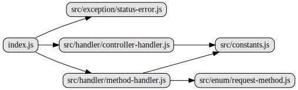

# 源码阅读

装饰器，通过Reflect.defineMetadata()设置元数据，在初始化时通过Reflect.getMetadata()对数据进行处理，拼接router和swagger文档参数。


## 文件结构

``` bash
├── index.js - 取出各种元数据，配置swagger和router，在router回调中执行真的的控制器方法
├── src
|  ├── constants.js - 各个常量
|  ├── enum
|  |  └── request-method.js - 请求头method常量
|  ├── exception
|  |  └── status-error.js - 继承自Error对象，设置status，默认500
|  └── handler
|     ├── controller-handler.js - 类装饰器，定义各种元数据
|     └── method-handler.js - 方法装饰器，定义各种元数据
```

## 内部模块依赖



## 逐个文件分析

### index.js

拼接swagger的参数。

遍历传入MethodHandler类的map，也就是控制器列表，使用ControllerHandler.getMetada取出其控制器的元数据。

针对swagger进行配置。

再遍历当前controller上的方法列表。针对每个方法，使用MethodHandler.getMetada取出器方法的元数据。

进行swagger进行配置。

将解析出来的对应的方法和回调挂载在app.router上。

真正的router回调函数中，面向切片执行before和after，执行控制器实例的对应方法，将结果返回到response.body上。


### src/handler/method-handler.js

定义并暴露MethodHandler类。

定义getMetada()方法获取到所有的元数据。基于原生Reflect.getMetadata方法。

定义了一系列方法如get/post/options/head/before/after等等。通过Reflect.defineMetadata定义元数据到私有变量上。


### src/handler/controller-handler.js

定义并暴露ControllerHandler类。

定义getMetada()方法获取到所有的元数据。基于原生Reflect.getMetadata方法。

定义了一些列方法如beforeAll/afterAll/prefix/hiddenAll等方法。通过Reflect.defineMetadata定义元数据到私有变量上。